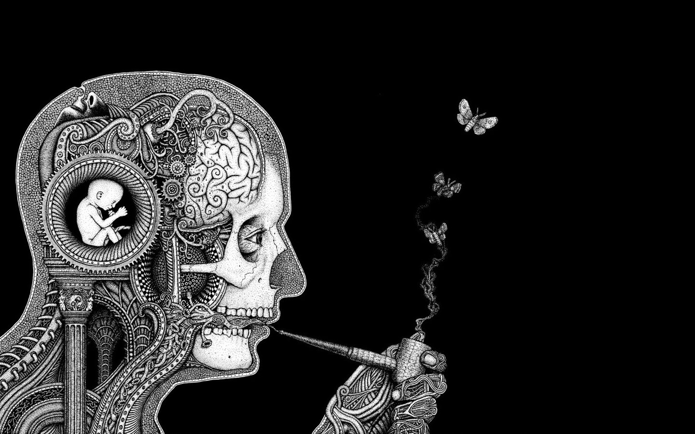

## Welcome to my humble home page. I hope you find what you looking for.

 

  

 

### States:
- 🔭 I’m currently working on minishell written in c for school, and AutoReservation an android app as an aside project
- 👯 I’m looking to collaborate on any android project with kotlin
- 📫 Email me: azeddine.hmd@gmail.com
- ⚡ btw, I use arch

### Favorites:
  - operating system: Arch Linux
  - window manager: Suckless DWM
  - terminal: Alacritty
  - terminal multiplexer: Tmux
  - Text Editor: Neovim
 
 ### Cards:

